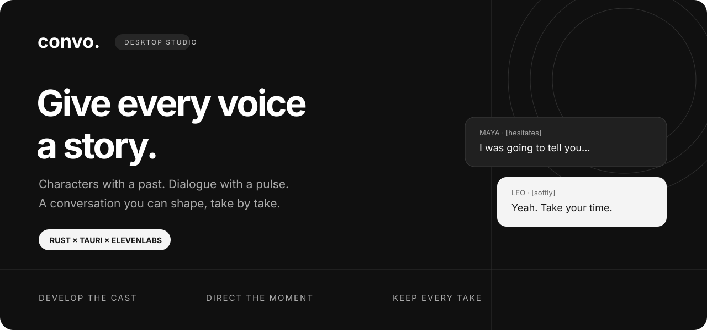
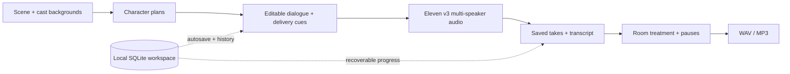

<div align="center">



**A local-first desktop studio for expressive AI conversations.**

Write the scene. Develop the people. Direct the performance.

[](https://github.com/realnoob007/convo/actions/workflows/check.yml)


[Get started](#get-started) · [Features](#inside-the-studio) · [Connect your model](docs/PROVIDERS.md) · [Architecture](docs/PUBLIC_ARCHITECTURE.md)

</div>

A good conversation has more than two voices. It has people who remember things differently. A question that changes the next answer. A pause before someone says what they mean.

Convo gives you control over those details: character backgrounds, lived experiences, delivery cues, pacing, reusable voices, and the sound of the room. Move from a brief to an editable script, then from a performance to a finished WAV or MP3—all in one desktop workspace.

> **Development preview.** Source builds are available; signed, one-click installers are not released yet. macOS has been tested locally. Windows and Linux have CI build/check jobs, with native device testing still needed. Generation uses your provider accounts and may incur charges.

## Inside the studio

| | What you can do |
|---|---|
| **Characters before dialogue** | Give each speaker one editable background. Convo first develops an independent personality, perspective, knowledge limits, and relevant experiences, then uses that plan to write the conversation. Inspect the character notes and distinguish supplied facts from fictional material. |
| **Context-aware performance** | Guide pacing and emotional expression. Edit dialogue, speaker assignments, inline Eleven v3 audio tags, and additional pauses. Direction follows the scene and neighboring turns. |
| **Short scenes to long conversations** | Set a duration target of up to 20 minutes, including 15-minute interviews. Long scripts render in bounded parts. Duration is a target, not a timing guarantee. |
| **Your choice of text model** | Use OpenAI or an OpenAI-compatible base URL. Choose Responses or Chat Completions and enter a custom model ID. Both character planning and script generation use the selected connection. |
| **A reusable voice library** | Sync ElevenLabs voices, audition a voice, and assign it across projects. Create an Instant Voice Clone from multiple files or design a new voice from a descriptive prompt and audition the previews. |
| **Record your own samples** | Select a microphone, record multiple clips, preview them, combine them with imported audio, and check for silence or clipping before uploading. Saved recordings remain available locally. |
| **Every take stays yours** | Generate new takes without replacing earlier audio. Keep completed parts after failures; pause, cancel, and resume supported render jobs. Ambiguous provider outcomes are surfaced instead of silently repeating a billable request. |
| **Listen and finish** | Play an assembled conversation with transcript navigation. Export a complete WAV or MP3. Cached previews make repeat listening faster. |
| **Shape the recording** | Choose clean audio, a phone in a room, or a phone-call treatment. Adjust microphone distance, synthetic room tone, and extra pauses locally without regenerating voices. Originals remain intact. |
| **Study the rhythm** | Analyze a local reference recording for duration and silence patterns. The reference-analysis action does not upload the file. |
| **Pick up where you left off** | Automatic SQLite saves, immediate recovery drafts, and restorable project history. Projects, voices, character plans, recordings, and takes persist on your device. |
| **A quieter interface** | Black, white, and gray shadcn/ui components. Light/dark themes. English, Español, 简体中文, 繁體中文, and 日本語 interfaces. UI language is independent of the conversation language. |

## From an idea to a performance



1. **Set the scene.** Describe what brings the speakers together, what they want, and how the conversation should feel.
2. **Build the cast.** Write a background for each person and select a voice. The background shapes their experiences; the voice shapes how you hear them.
3. **Generate and direct.** Review the character notes and script. Refine the wording, delivery tags, and pauses before spending audio credits.
4. **Record a take.** Listen, compare, and iterate. Each render is saved separately.
5. **Place it in a room.** Apply a recording treatment and export the complete conversation.

## Get started

Install **Node.js 22.12+**, a current stable **Rust** toolchain, and the [Tauri prerequisites for your OS](https://v2.tauri.app/start/prerequisites/).

```sh
git clone https://github.com/realnoob007/convo.git
cd convo
npm ci
npm run tauri dev
```

In **Settings → API connections**:

- Configure your text provider's base URL, API format, and API key.
- Add an ElevenLabs API key, then sync the voice library.
- Enter a model ID supported by your text provider in the studio's **Script model** field.

Start with a short scene to check your model, voices, and delivery before rendering a long conversation. See the [provider setup guide](docs/PROVIDERS.md) for compatible endpoint requirements and troubleshooting.

<details>
<summary><strong>Frontend-only preview</strong></summary>

```sh
npm run dev
```

This opens a browser preview for editing, appearance, and local history. Provider API calls and native recording/storage require the desktop app. Browser-preview projects are separate from the desktop database.

</details>

<details>
<summary><strong>Build and verify</strong></summary>

```sh
npm run build
npm test
npm run lint
cargo fmt --manifest-path src-tauri/Cargo.toml -- --check
cargo test --locked --manifest-path src-tauri/Cargo.toml
cargo clippy --locked --manifest-path src-tauri/Cargo.toml --all-targets -- -D warnings
npm run tauri build
```

Local validation: **50 Rust tests and 22 frontend tests**, TypeScript/Vite build, lint, Clippy, and a macOS development bundle. Compatible endpoint routing is covered by local HTTP integration tests; individual third-party services still need testing with their supported models.

Build on the target OS. Microphone capture depends on OS permissions and the platform WebView. The CI workflow checks macOS, Windows, and Linux; its artifacts are development binaries, not signed installers.

</details>

## Your workspace, your connections

Convo stores projects and media in the OS application-data directory for `studio.convo.desktop`. On macOS, that is `~/Library/Application Support/studio.convo.desktop`.

| Data | Storage / destination |
|---|---|
| Projects, revisions, voice metadata, takes | Local SQLite workspace |
| Recorded voice samples | Local `voice-samples/` directory |
| Generated audio and previews | Local `audio/` directory |
| API keys and endpoint configuration | Separate local `credentials.sqlite3`, outside project history and exports |
| Scene, cast backgrounds, character plans | Sent to your configured text provider when generating |
| Dialogue and selected voice IDs | Sent to ElevenLabs when rendering |
| Selected clone samples | Uploaded to ElevenLabs only when creating a voice |

The credential database is **not encrypted**; Unix file permissions are restricted to its owner. Convo does not prompt for the OS keychain. Protect device access and backups. Changing the text-provider address requires a key for the new address; the saved OpenAI key is not automatically forwarded to it.

No cloud project synchronization is implemented. Voice cloning requires the speaker's permission. Synthetic conversations should be identified as such when used for demonstrations, interviews, or research practice.

## Built with

**Rust + Tauri 2** handle persistence, provider requests, audio processing, and job recovery. **React + TypeScript + shadcn/ui + Tailwind** power the editor. **SQLite** keeps the workspace local. **OpenAI-compatible structured generation** develops characters and dialogue; **ElevenLabs** supplies voice creation and expressive multi-speaker synthesis.

[Read the architecture →](docs/PUBLIC_ARCHITECTURE.md)

## What comes next

- Signed desktop installers and broader hardware validation.
- Richer timeline editing and overlapping speech.
- More provider compatibility testing and generation-quality evaluations.

Convo is actively evolving. If something feels unnatural, a precise example helps: the script excerpt, model, voice type, and what you expected to hear. Please remove keys and private recordings before opening an issue.
